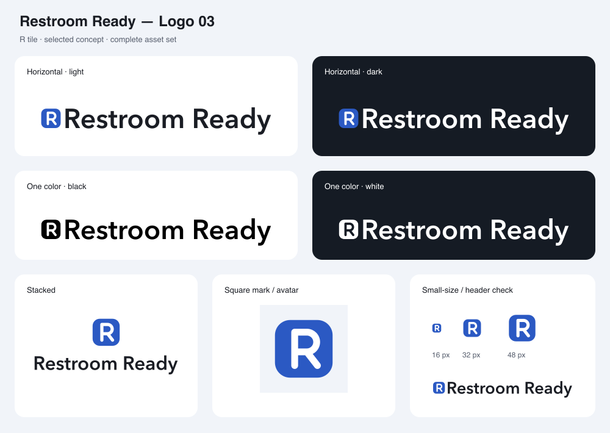

# Restroom Ready — Logo files

Selected concept: **03 — R tile**. The original drawing remains in round1/. Its rounded tile and uppercase R geometry are preserved. The final mark has a tighter square viewBox for use at small sizes.

## Main files

| File | Use |
| --- | --- |
| [mark.svg](mark.svg) | Blue rounded tile with a white uppercase R. |
| [wordmark.svg](wordmark.svg) | Outlined **Restroom Ready** lettering. |
| [lockup.svg](lockup.svg) | Horizontal mark and name. |
| [stacked.svg](stacked.svg) | Mark above the name. |
| [square_mark.svg](square_mark.svg) | Square icon with an opaque pale background. |
| [avatar.png](avatar.png) | 512 × 512 social avatar. |
| [logo_light.svg](logo_light.svg) | Horizontal logo on a white background. |
| [logo_dark.svg](logo_dark.svg) | Horizontal logo on a dark background. |
| [logo_black.svg](logo_black.svg) | Transparent one-color black logo. |
| [logo_white.svg](logo_white.svg) | Transparent one-color white logo. Place on a dark surface. |
| [mark_16.svg](mark_16.svg) | Small-size adaptation for 16 px use. |

Transparent dark-use, black, and white files are supplied for the mark, wordmark, and horizontal lockup. The stacked and square marks also have dark-use variants. PNG copies of the main lockup, background variants, and stacked logo are included.

## Color and lettering

- Tile: **#2B59C3**. R: **#FFFFFF**. Default wordmark: **#1A1D24**.
- Dark-use wordmark: **#FFFFFF** on **#151B24**. The blue tile and white R stay the same.
- One-color versions use a solid black or white tile with a transparent R cutout, plus matching lettering.
- The wordmark uses **Avenir Next Demi Bold**, converted to paths. The lettering is self-contained. This choice applies to the logo, not the site's proposed typography.

## Size and spacing

In the horizontal lockup, the visible mark height equals the wordmark's capital-letter height. Keep at least one quarter of the tile width as clear space around the artwork and retain the supplied proportions and spacing.

The standalone mark works down to **16 px** using mark_16.svg. This adaptation uses a 5-unit R stroke. Larger versions retain the original 4.5-unit stroke.

Use the standalone mark when space is too small for the name to read comfortably. The preview sheet includes a compact header lockup and marks at 16, 32, and 48 px.

## Favicons and app icons

| File | Dimensions | Background |
| --- | --- | --- |
| [favicon_16.png](favicon_16.png) | 16 × 16 | Transparent; adapted small mark. |
| [favicon_32.png](favicon_32.png) | 32 × 32 | Transparent. |
| [favicon_48.png](favicon_48.png) | 48 × 48 | Transparent. |
| [favicon_180.png](favicon_180.png) | 180 × 180 | Opaque square mark. |
| [favicon_192.png](favicon_192.png) | 192 × 192 | Opaque square mark. |
| [favicon_512.png](favicon_512.png) | 512 × 512 | Opaque square mark. |

The assets.json file records the source drawing, colors, lettering, sizes, and generated file inventory.
