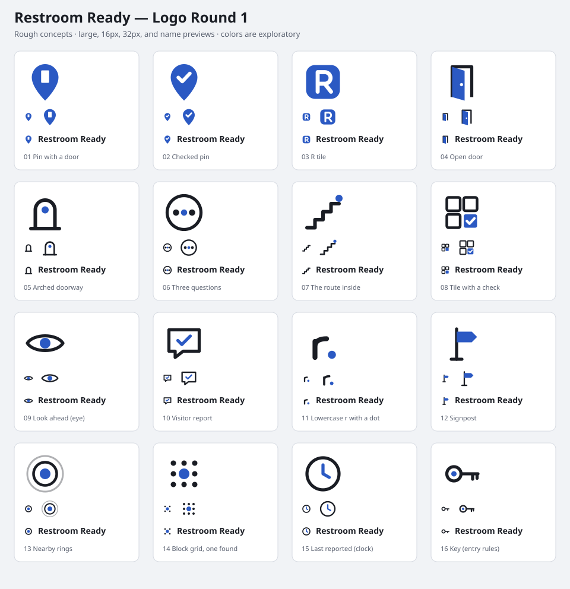

# Restroom Ready — Style Exploration, Round 1

Six proposed page directions and sixteen rough logo ideas are shown below. Compare layout, hierarchy, cards, navigation, and controls. Fonts are suggestions.

These design notes use illustrative listings that do not describe real places.

## Shared hero

- Tagline: **Know before you go.**
- Headline: **Find a restroom you can use in NYC.**
- Main action: **Join the waitlist.**

Each option uses a hero and supporting section. Content covers reported conditions, entry rules, the route inside, report dates, and unknown details.

## Six proposed directions

| Direction | Suggested typography | Structure |
| --- | --- | --- |
| A — Transit signage | Archivo / Archivo Narrow | Bold headline, pill-shaped main action, and three stacked rows with circular letter markers, short headings, and supporting text. |
| B — Inspection checklist | IBM Plex Mono / IBM Plex Sans | Monospace labels and a bordered listing sheet. Three checklist columns separate Entry, Route, and Condition. Dashed boxes show unknowns. Columns stack on mobile. |
| C — Soft calm | Lexend | Spacious hero and three rounded cards, each with an icon, heading, and short explanation. Cards stack on mobile. |
| D — Civic poster | Big Shoulders Display / Work Sans | Large condensed headline, supporting copy beside the main action, and sticker-like information labels. Unknown labels have dashed outlines. |
| E — Porcelain tile | Newsreader / Karla | Serif headline and a bordered listing sheet. Dotted leaders connect labels to right-aligned values. The main action is rectangular and outlined. |
| F — Night map | Manrope / JetBrains Mono | Hero copy beside a map preview and floating listing card. Facts use label–value rows. The two-column layout stacks on mobile. |

### A — Transit signage

**Hero copy:** We're building a map that brings together visitor-reported conditions, entry rules, and the route to the restroom. See when details were reported and what is still unknown.

| Marker | Supporting heading | Copy |
| --- | --- | --- |
| E | Check the entry rules | Public, customers only, or a code at the counter. |
| R | Check the route inside | Which floor, and whether there are stairs after the door. |
| C | Check the basics | Soap, toilet paper, a usable stall, and when someone last reported it. |

### B — Inspection checklist

**Hero copy:** Visitor-reported conditions, entry rules, and the route inside, each with when it was reported and who reported it.

**Example listing: Corner café · Chelsea**

| Group | Illustrative details |
| --- | --- |
| Entry | Purchase required; code on receipt; restroom hours not reported. |
| Route | Restroom floor one level down; stairs to restroom yes; elevator not reported. |
| Condition | Soap reported; toilet paper reported; floor not reported. |
| Footer | Last reported: example date and example visitor counts. |

### C — Soft calm

**Hero copy:** We're building a map of visitor-reported conditions, entry rules, and the route inside, so you can choose before you walk over.

| Supporting heading | Copy |
| --- | --- |
| Check the basics | Soap, paper, a usable stall, with the date it was reported. |
| Check the entry rules | Customers only, a purchase, or a code, before you get there. |
| Check the route inside | Which floor it's on and whether there are stairs. |

### D — Civic poster

**Hero copy:** Visitor-reported conditions, entry rules, and the route inside, with the date on every report.

**Supporting section: What a listing tells you**

- Purchase required
- Restroom floor: lower level
- Stairs to restroom
- Soap · reported
- Elevator · not reported

These are example labels only, not a real listing.

### E — Porcelain tile

**Hero copy:** Visitor-reported conditions, entry rules, and the route to the restroom. Every detail shows when it was reported, and what's still unknown says so.

**Example listing: Bookshop, Upper West Side**

| Detail | Example value |
| --- | --- |
| Entry | Customers only |
| Restroom floor | Second floor |
| Stairs to restroom | One flight |
| Elevator | Not reported |
| Soap · paper | Reported |
| Last reported | Example date |

### F — Night map

**Hero copy:** A map of visitor-reported conditions, entry rules, and the route inside. Check the details before you walk over.

**Example listing: Library branch**

| Detail | Example value |
| --- | --- |
| Entry | Public |
| Restroom floor | Street level |
| Stairs | None reported |
| Condition | Soap, paper reported |
| Last reported | Example date |

## Logo ideas, Round 1

The rough marks explore pins, doors, questions, routes, reports, and time. Compare them at 16 px and 32 px and beside **Restroom Ready**.

| No. | Proposed mark |
| --- | --- |
| 01 | [Pin with a door](../logo/round1/concept-01.svg) |
| 02 | [Checked pin](../logo/round1/concept-02.svg) |
| 03 | [R tile](../logo/round1/concept-03.svg) |
| 04 | [Open door](../logo/round1/concept-04.svg) |
| 05 | [Arched doorway](../logo/round1/concept-05.svg) |
| 06 | [Three questions](../logo/round1/concept-06.svg) |
| 07 | [The route inside](../logo/round1/concept-07.svg) |
| 08 | [Tile with a check](../logo/round1/concept-08.svg) |
| 09 | [Look ahead (eye)](../logo/round1/concept-09.svg) |
| 10 | [Visitor report](../logo/round1/concept-10.svg) |
| 11 | [Lowercase r with a dot](../logo/round1/concept-11.svg) |
| 12 | [Signpost](../logo/round1/concept-12.svg) |
| 13 | [Nearby rings](../logo/round1/concept-13.svg) |
| 14 | [Block grid, one found](../logo/round1/concept-14.svg) |
| 15 | [Last reported (clock)](../logo/round1/concept-15.svg) |
| 16 | [Key (entry rules)](../logo/round1/concept-16.svg) |

## Next steps

Record what to keep or change and why. Choose 2–3 page directions and a few logo concepts for Round 2. Check mobile layouts and small marks. After refinement, record final typography, colors, spacing, components, and logo rules, then export logo variants and favicons.
